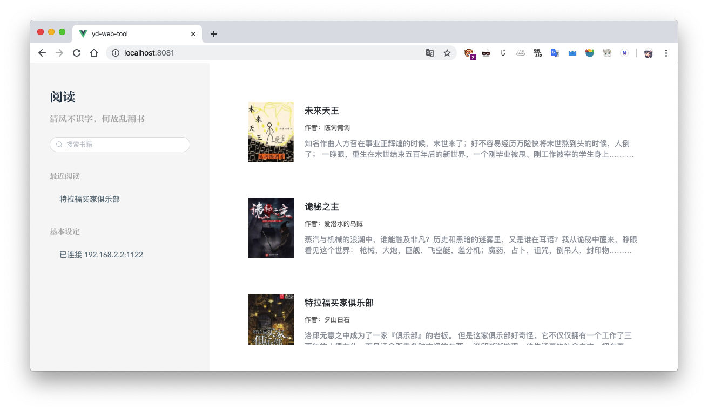
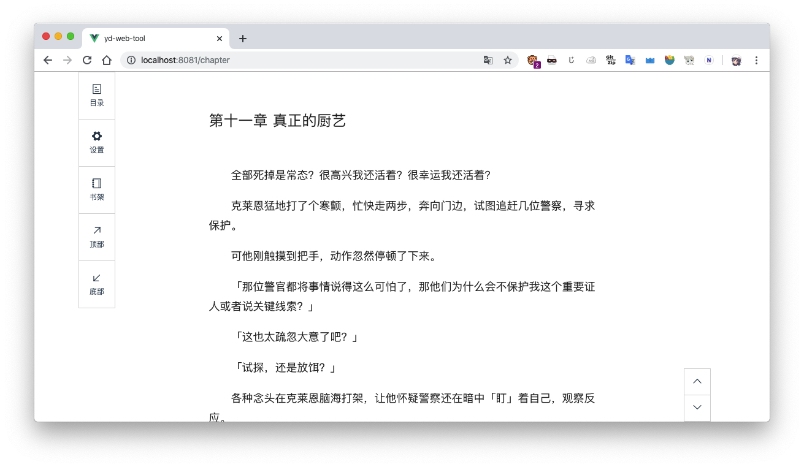
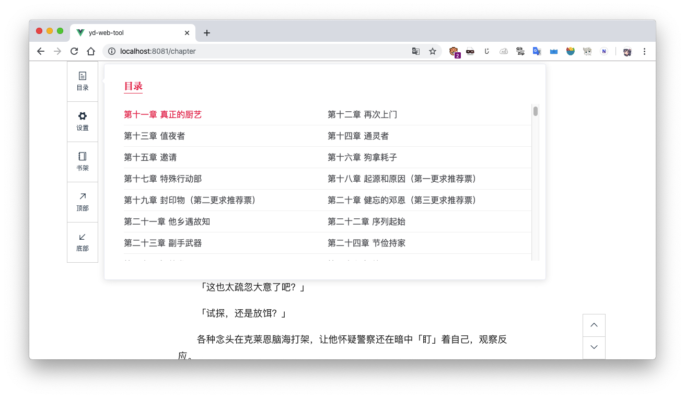

# 「阅读」 web 端

本程序为「阅读」的配套 web 端，需要保证手机和电脑在同一局域网内，然后手机端打卡 web 服务。

## 具体实现

使用 Vue2 开发

## 使用方法

```shell
yarn install
#安装项目
yarn serve
#开发模式
yarn build
#打包
yarn lint
#格式化代码
```

## 预览





## todo

- [ ] 同步手机端进度
- [ ] 阅读页面设置
- [ ] PWA 支持
- [ ] 细节优化
